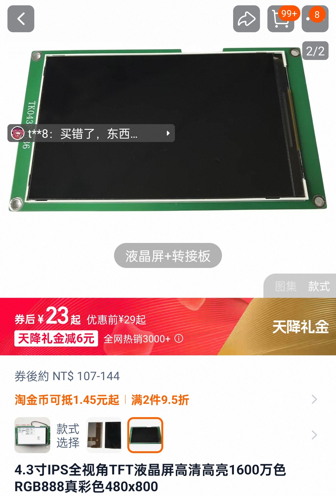
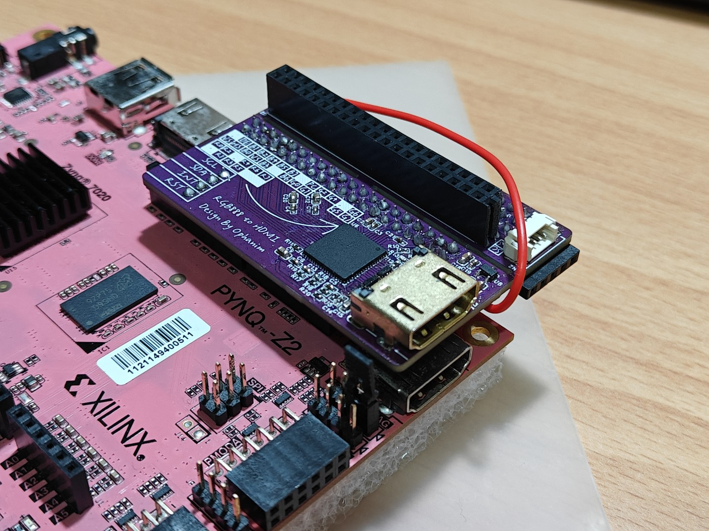
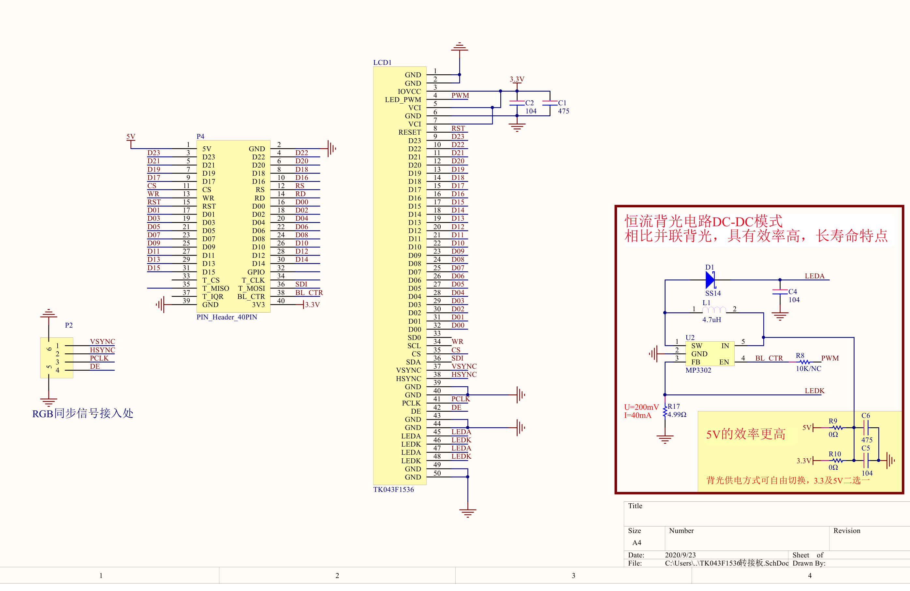
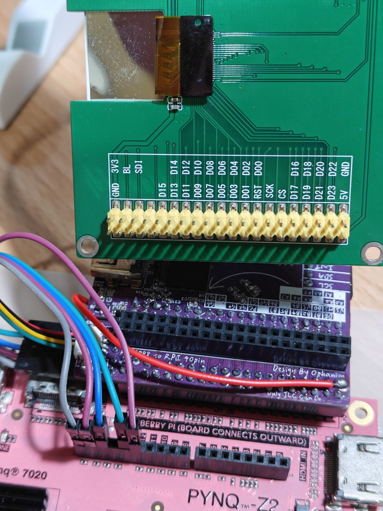
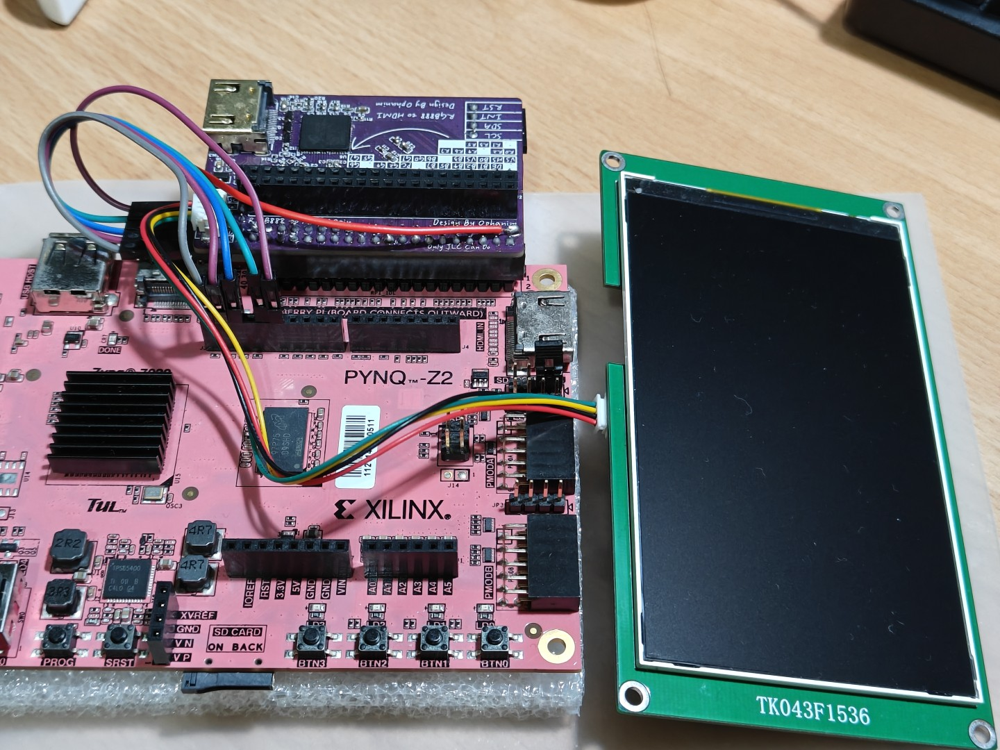
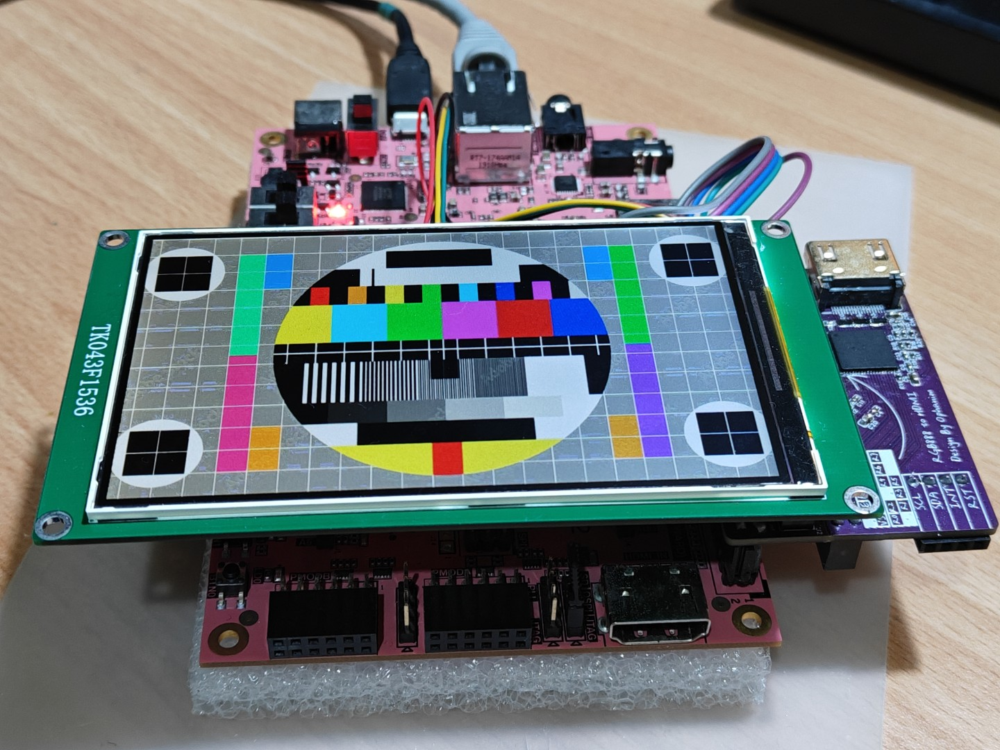
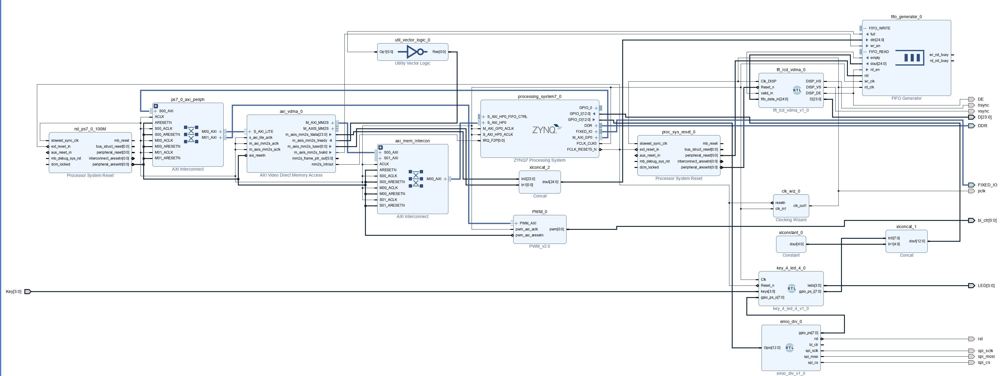

# PYNQ-Z2-with-RGB888-LCD-AND-HDMI-Board

This adapter board is designed to connect a **4.3-inch RGB888 TFT LCD** (sourced from the Taobao store **Tiky**) to the PYNQ-Z2. 

**Bonus Feature:**  
The design includes a **SII9022A** chip. By plugging the adapter board into the header in reverse, the system can support an additional **HDMI output channel**.

---

## Project Status & Display Specifications
Currently, this project has verified the **LCD Adapter Board** functionality. 

**Key Note on Resolution:**  
The display uses a **native portrait resolution of 480x800**(LCD Driver LG4573B). During development, I found that the official Xilinx VTC (Video Timing Controller) + VDMA IP pipeline was unable to generate HSYNC and VSYNC signals for this specific vertical orientation. 

**Workaround:**  
To resolve this, I modified a custom VGA signal output IP to act as a combined VTC and Video Out module. The interface logic for the VDMA was implemented with assistance from **Gemini**. 

> [!TIP]
> If any experienced developers know how to properly configure the official Xilinx VTC IP for native portrait resolutions, please feel free to leave a comment or open an issue!

---

## Hardware Interface & Pin Expansion
Based on the official schematics, an **RGB888** interface requires more pins than the standard PYNQ-Z2 (Raspberry Pi compatible) 40-pin header can provide. 

To ensure full compatibility:
*   **Expansion Headers:** Additional DuPont line interfaces and an **MX1.25 6-pin connector** have been added to the side of the board to break out all RGB888 signals.
*   **Customization:** Users can manually downscale the interface to **RGB444** or **RGB565** if fewer pins are desired, allowing the DuPont connections to be integrated back into the main adapter pins.

## Clock Domain Crossing (CDC) & FIFO Implementation
Since the VDMA and the custom VTC+Video Out IP operate at different clock frequencies, a buffer is necessary for stable data transmission:
*   **VDMA Clock:** 100 MHz
*   **Custom IP (PCLK):** 33 MHz

**Implementation:**  
An **Asynchronous FIFO** (Independent Clock mode) is utilized between the two IPs. The `TUSER` (1-bit) and `TDATA` (24-bit) signals from the VDMA are combined into a **25-bit data packet** before being written to the FIFO. On the reading side, the custom IP separates the signals for final output.

---

## SPI Initialization & EMIO Configuration
The screen initialization commands are sent from the Processing System (PS) side using **EMIO-simulated SPI**. 

**Why EMIO instead of Native SPI?**  
Testing showed that the native PS SPI interface—even with specific configuration tweaks—would intermittently pull the **CS (Chip Select)** pin HIGH during continuous 16-bit data transfers. This caused initialization commands to fail. Switching to EMIO SPI simulation provided a more stable timing environment. 

*If a solution for stabilizing the native SPI during 16-bit bursts is found, the EMIO method can be replaced.*

